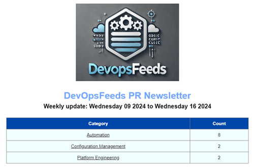

# ![FeedLogo] DevOps Feeds

The DevOps Feeds repository is inspired by newsletters created by other community members in the IT. Each newsletter always have their own purpose and goal to deliver content. The purpose of this project is quite clear: to make newsletters that are recognizable, engaging and a focus on DevOps areas.

<div align="center">
  
  
</div>

While the project started as a hobby for me to learn some HTML and CSS, I wanted to get a clear overview of what happened over the week across various open-source projects. I think many developers track issues, watch for releases, or review pull request on GitHub. GitHub provides a lot of data and I wanted to grab this data to keep me informed. And so can you. In the next section, you find the available newsletter were you can subscribe. It's free and you can always easily unsubscribe.

The following newsletter are configured through Azure Pipelines. In the  folder, you can find the scheduled times.

- [Pull Request Newsletter](http://eepurl.com/i1hSUw)
- [GitHub Releases Newsletter](https://mailchi.mp/cb1284ffa82a/devops-feeds)

The information collected in the newsletters, are through open-source GitHub projects based on category. Each category is divided into sub-sections to easily skim for content relevant to you.

## Features

- Easy to setup campaign content
- Support dynamic feed data
- Integration with MailChimp templates and sections
- Uses Azure Pipelines to deliver mail

## Installation

The repository published a PowerShell module named `MailChimp`. You can use the following command to install the module from the PSGallery:

```powershell
Install-PSResource -Name MailChimp -Repository PSGallery
```

## Usage

If you want to play with the PowerShell module, you can check out the following code samples:

```powershell
# Retrieve campaign content
$campaigns = Get-MailChimpCampaign # get all campaigns on MailChimp
Get-MailChimpCampaignContent -Id $campaigns[0].Id

# Update campaign content
Update-MailChimpCampaign -Id "your-campaign-id" -Html "<h1>Sample HTML</h1>"
```

## Pipeline setup

Each pipeline is configured on a scheduled trigger. The steps are mostly unique, but can differ in the feeding of data:

1. Bootstrap the environment on ubuntu-latest agent
2. Collect data using GitHub's CLI
3. Connects to MailChimp API
4. Generates MailChimp newsletter as HTML
5. Create campaign in MailChimp with results from 1 week
6. Send out campaign to audience

Both MailChimp API and GitHub are authenticated using API keys. For more information, check out [MailChimp API reference](https://mailchimp.com/developer/marketing/) or [GitHub CLI](https://cli.github.com/manual/gh_auth_login) documentation.

## Contributing

We welcome contributions to the repository. The process to include a new feed is straightforward. If you find a feed you want to add, check out the [data files](./res/data/). You can fork the repository, add your feed, and push the changes.

If you have any other suggestions, bug reports, or feature requests, please open an issue or submit a pull request.

## License

This project is licensed under the MIT License. See the [LICENSE](LICENSE) file for more details.

## Support me

If you find this project useful and newsletter useful, consider [buying me a coffee](https://buymeacoffee.com/gijsreijnt)! :coffee:

<!-- References -->
[FeedLogo]: .images/newsletter-40.png
[Newsletter]: .images/image-newsletter.png
[BuyMeACoffee]: .images/buy-me-a-coffee.png
