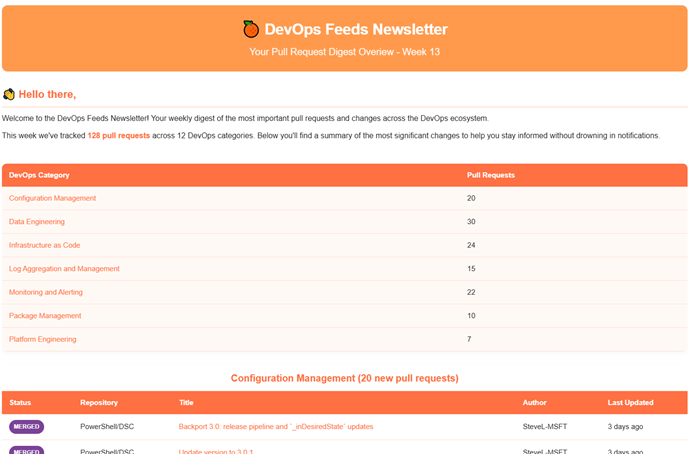

# ![FeedLogo] DevOpsFeeds

The DevOpsFeed repository is inspired by the Azure Weekly newsletter. The newsletter on Azure content is developed by Luke Murray, a Microsoft MVP. If you've subscribed to Azure Weekly newsletter, you will likely recognize the design slightly for the newsletters that fly around:

<p align="center">
  
</p>

The purpose of this project is quite clear: to make newsletters that are recognizable and engaging. While the project started as a hobby for me to learn some HTML and CSS, I wanted to get a clear overview of what happened over the week across various open-source projects, whether they were just created, merged, or closed. It kept me informed, and so can you. The next section lists out the available newsletters were you can subscribe. It's free and you can always unsubscribe easily.

The following newsletters are configured and run every Sunday at 06:00:

- [Pull Request Newsletter](http://eepurl.com/i1hSUw)

The information collected in the newsletters, are through open-source GitHub projects based on category. Each category is divided into sub-sections to easily skim for content relevant to you.

## Features

- Easy to setup campaign content
- Support dynamic feed data
- Integration with MailChimp templates and sections
- Azure DevOps pipeline to send email

## Installation

The repository published a PowerShell module named `MailChimp`. You can use the following command to install the module from the PSGallery:

```powershell
Install-PSResource -Name MailChimp -Repository PSGallery
```

## Usage

If you want to play with the PowerShell module, you can check out the following code samples:

```powershell
# Retrieve campaign content
$campaigns = Get-MailChimpCampaign # get all campaigns on MailChimp
Get-MailChimpCampaignContent -Id $campaigns[0].Id

# Update campaign content
Update-MailChimpCampaign -Id "your-campaign-id" -Html "<h1>Sample HTML</h1>"
```

## Pipeline setup

Each Sunday at 6 o'clock, a scheduled trigger runs a pipeline. The steps the pipeline performs:

1. Bootstrap the environment on ubuntu-latest agent
2. Collect data using GitHub's CLI
3. Connects to MailChimp API
4. Generates MailChimp newsletter as HTML
5. Create campaign in MailChimp with results from 1 week
6. Send out campaign to audience

Both MailChimp API and GitHub are authenticated using API keys. For more information, check out [MailChimp API reference](https://mailchimp.com/developer/marketing/) or [GitHub CLI](https://cli.github.com/manual/gh_auth_login) documentation.

## Contributing

We welcome contributions to the repository. The process to include a new feed is straightforward. If you find a feed you want to add, check out the [data files](./res/data/). You can fork the repository, add your feed, and push the changes.

If you have any other suggestions, bug reports, or feature requests, please open an issue or submit a pull request.

## License

This project is licensed under the MIT License. See the [LICENSE](LICENSE) file for more details.

## Support me

If you find this project useful and newsletter useful, consider [buying me a coffee](https://buymeacoffee.com/gijsreijnt)! :coffee:

<!-- References -->
[FeedLogo]: .images/newsletter-40.png
[Newsletter]: .images/image-newsletter.png
[BuyMeACoffee]: .images/buy-me-a-coffee.png
